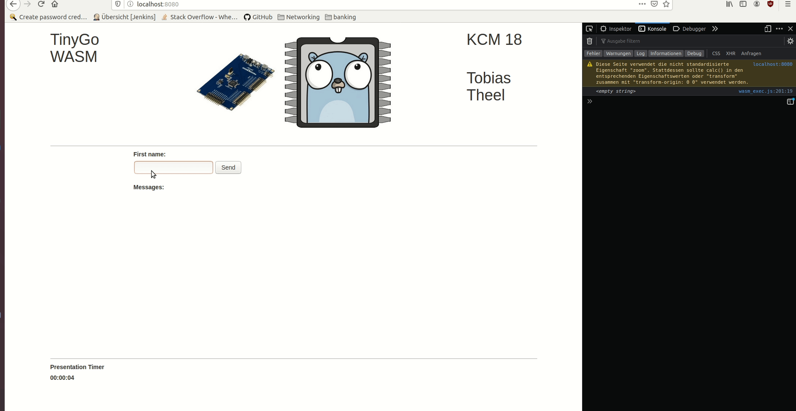

# tinygo-playground

Examples do work with Arduino Uno

## starting vscode

> export GOOS=linux; export GOARCH=arm; export GOFLAGS=-tags=avr,baremetal,linux,arm,atmega328p,atmega,avr5,arduino,tinygo,gc.conservative,scheduler.none; code

## Flashing blink-sos

>  tinygo flash --target=arduino cmd/blink-sos/sos.go

## Flashing traffic-light

>  tinygo flash --target=arduino cmd/traffic-light/light.go

## Flashing traffic-button-light

>  tinygo flash --target=arduino cmd/traffic-button-light/light.go

## hello-display

[turorial](https://www.arduino.cc/en/Tutorial/HelloWorld)
[image](https://www.arduino.cc/en/uploads/Tutorial/LCD_Base_bb_Fritz.png)

>  tinygo flash --target=arduino cmd/hello-display/main.go

## Debugging

use println("text)

And when the arduino is running do 

> cat /dev/ttyACM0

## Common Problems

> avrdude: ser_open(): can't open device "/dev/ttyACM0": Permission denied

Change persmissions of the serial port by using the following command
> sudo chmod a+rw /dev/ttyACM0

## WASM

### Compile 
> tinygo build -o ./wasm.wasm -target wasm ./main/main.go

### Make
> make main

### Start the Server

>  go run server.go

### Compiled "main" example

